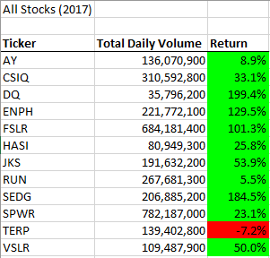
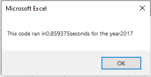
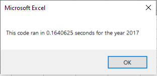
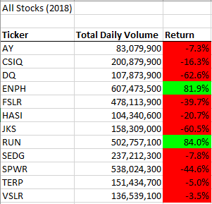
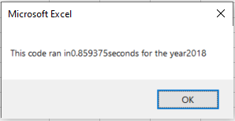
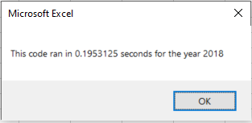

# Alternative Energy Stocks Analysis Using VBA

## Overview of Project
My friend Steve has asked me to help him collect and analyze data. Steve is a financial analyst who wants to help his parents invest in alternative energy. He wants data collected for alternative energy stocks. To help him, I will use VBA in Excel to create a report that quickly and efficiently presents the stock data in a very comprehensible manner.

### Purpose
This project highlights the power of **VBA** and its ability to enhance and expedite an analyst's process. Using VBA, I will create an input box that allows Steve to select the data's fiscal year and then filter through 12 different stocks simultaneously to produce a series of calculations. Once the code completes its calculations, it will create a table that exhibits each stock's _Total Daily Volume_ and yearly _Return_ percentage. This report will ultimately help Steve determine which stocks his parents could choose from to invest in.

In addition to the report, I will attempt to restructure or _refactor_ my own code.  Ideally, this will cut the code run time down by a respectable amount. The code will also look cleaner and leaner. Steve may not notice these changes from the end-user perspective, but he will hopefully notice that the analysis is conducted fairly quickly.

## Results

### VBA Code Comparison
_**Original Refactored Code**_

The original code is already somewhat completed by the deliverable challenge. It is comprised of the code that was written in Module 2 weekly assignments. This refactor assignment removes our original `For loops`, `Nested loops`, and `If-Then` statements that were written for each stock ticker. The deliverable asks us to re-examine our original code and reconsider a more efficient method. Once I discover a solution, I must fill in the blanks of the commented sections.

Provided Refactored Code

 
    
    Sub AllStocksAnalysisRefactored()
    Dim startTime As Single
    Dim endTime  As Single
  
    yearValue = InputBox("What year would you like to run the analysis on?")

    startTime = Timer
    
    'Format the output sheet on All Stocks Analysis worksheet
    Worksheets("All Stocks Analysis").Activate
    
    Range("A1").Value = "All Stocks (" + yearValue + ")"
    
    'Create a header row
    Cells(3, 1).Value = "Ticker"
    Cells(3, 2).Value = "Total Daily Volume"
    Cells(3, 3).Value = "Return"

    'Initialize array of all tickers
    Dim tickers(12) As String
    
    tickers(0) = "AY"
    tickers(1) = "CSIQ"
    tickers(2) = "DQ"
    tickers(3) = "ENPH"
    tickers(4) = "FSLR"
    tickers(5) = "HASI"
    tickers(6) = "JKS"
    tickers(7) = "RUN"
    tickers(8) = "SEDG"
    tickers(9) = "SPWR"
    tickers(10) = "TERP"
    tickers(11) = "VSLR"
    
    'Activate data worksheet
    Worksheets(yearValue).Activate
    
    'Get the number of rows to loop over
    RowCount = Cells(Rows.Count, "A").End(xlUp).Row
    
    '1a) Create a ticker Index
    

    '1b) Create three output arrays
    
    
    ''2a) Create a for loop to initialize the tickerVolumes to zero.
    
        
    ''2b) Loop over all the rows in the spreadsheet.
    For i = 2 To RowCount
    
        '3a) Increase volume for current ticker
        
        
        '3b) Check if the current row is the first row with the selected tickerIndex.
        'If  Then
            
            
            
        'End If
        
        '3c) check if the current row is the last row with the selected ticker
         'If the next row’s ticker doesn’t match, increase the tickerIndex.
        'If  Then
            
            

            '3d Increase the tickerIndex.
            
            
        'End If
    
    Next i
    
    '4) Loop through your arrays to output the Ticker, Total Daily Volume, and Return.
    For i = 0 To 11
        
        Worksheets("All Stocks Analysis").Activate
        
        
    Next i
    
    'Formatting
    Worksheets("All Stocks Analysis").Activate
    Range("A3:C3").Font.FontStyle = "Bold"
    Range("A3:C3").Borders(xlEdgeBottom).LineStyle = xlContinuous
    Range("B4:B15").NumberFormat = "#,##0"
    Range("C4:C15").NumberFormat = "0.0%"
    Columns("B").AutoFit

    dataRowStart = 4
    dataRowEnd = 15

    For i = dataRowStart To dataRowEnd
        
        If Cells(i, 3) > 0 Then
            
            Cells(i, 3).Interior.Color = vbGreen
            
        Else
        
            Cells(i, 3).Interior.Color = vbRed
            
        End If
        
    Next i
 
    endTime = Timer
    MsgBox "This code ran in " & (endTime - startTime) & " seconds for the year " & (yearValue)

    End Sub

_**My Refactored Code**_

My new refactored code is a success. However, it was difficult for me to complete a successful run. I spent several hours trying to debug my code. I discovered the solution is to run loops and `if-then` statements to access the correct index across new different arrays. These three new arrays are `tickervolumes`, `tickerStartingPrices`, and `tickerEndingPrices`. These arrays indexed the information for all 12 stocks. The new code no longer runs code for each ticker. The new code is restructured to run the three arrays, which have the 12 stocks indexed and their values. This new method is more efficient and effectively cut the run time by a considerable amount.

My Refactored Code

  
  
    '1a) Create a ticker Index
        Dim tickerIndex As Integer
            tickerIndex = 0                              
    '1b) Create three output arrays
        Dim tickerVolumes(12) As Long
        Dim tickerStartingPrices(12) As Single
        Dim and (12) As Single
            
    ''2a) Create a for loop to initialize the tickerVolumes to zero.
            For tickerIndex = 0 To 11
                tickerVolumes(tickerIndex) = 0
                                
            Next tickerIndex
            
            tickerIndex = 0
            
    ''2b) Loop over all the rows in the spreadsheet.
            For i = 2 To RowCount
    
        '3a) Increase volume for current ticker
                tickerVolumes(tickerIndex) = tickerVolumes(tickerIndex) + Cells(i, 8).Value
    
        '3b) Check if the current row is the first row with the selected tickerIndex.
            
                If Cells(i - 1, 1).Value <> tickers(tickerIndex) And Cells(i, 1).Value = tickers(tickerIndex) Then
                    tickerStartingPrices(tickerIndex) = Cells(i, 6).Value
                
                End If
                
                   
        '3c) check if the current row is the last row with the selected ticker
         'If the next row’s ticker doesn’t match, increase the tickerIndex.
        'If  Then
                If Cells(i + 1, 1).Value <> tickers(tickerIndex) And Cells(i, 1).Value = tickers(tickerIndex) Then
                        tickerEndingPrices(tickerIndex) = Cells(i, 6).Value
                           
            '3d Increase the tickerIndex.
                        tickerIndex = tickerIndex + 1
                
                End If
        
            Next i
            
        'End If
    
    '4) Loop through your arrays to output the Ticker, Total Daily Volume, and Return.
    Worksheets("All Stocks Analysis").Activate
    
    For i = 0 To 11
        
        Cells(4 + i, 1).Value = tickers(i)
        Cells(4 + i, 2).Value = tickerVolumes(i)
        Cells(4 + i, 3).Value = tickerEndingPrices(i) / tickerStartingPrices(i) - 1
        
        Next i

### _Year 2017 Stocks Analysis_

All stocks have a positive _Return_ percentage minus `TERP`. Based solely on this screenshot of stocks, there are a few stocks that stand out to me. Stocks with a higher trading volume and a decent to high return rate tend to be more sustainable in the long run. This is not always true for several reasons, but it is a pattern that some analysts review. Based solely on that trend, stocks that appear profitable for long-term investment are `ENHP`, `FSLR`, `RUN`, `SPWR`, and `CSIQ`. Steve will conduct his own thorough analysis, but these are stocks I see at a glance just based on 2017 data.

_**Original 2017 Runtime**_ 

_**Refactored 2017 Runtime**_

My refactored code cut the runtime down by .6953 seconds. Its original run time was .8594 seconds. Its new run time is now .1641 seconds. The run time was decreased by nearly 81% `(((.8594 - .1641) / .8594) * 100) = 80.9052`.
 

### _Year 2018 Stocks Analysis_

Conversely, 2018 stock data contradicts trends that were mentioned earlier. All but two stocks have a negative _Return_ percentage, `ENHP` and `RUN`. Reasons that may have caused these stocks to have a poor return are unknown. However, the two stocks `ENHP` and `RUN` I previously mentioned, still have the best return and the highest trading volumes. Perhaps I will suggest to Steve to further investigate those two stocks.

_**Original 2018 Runtime**_
  
 

_**Refactored 2018 Runtime**_

My refactored code cut the runtime down by .6641 seconds. Its original run time was .8594 seconds. Its new run time is now .1953 seconds. The run time was decreased by 77% `(((.8594 - .1953) / .8594) * 100) = 77.2748`.

## Summary

_**What are the advantages or disadvantages of refactoring code?**_

1. Advantages: Refactoring code is beneficial for multiple reasons. It allows the code to be more maintainable and efficient over the long term. It can make the code more scalable as well, which would be beneficial for larger datasets. Refactoring code makes the code run faster and removes any previous bugs.

2. Disadvantages: Refactoring code has some drawbacks as well. The biggest disadvantage is that it is time-consuming. Depending on the project deadline, it is said not to refactor code if the delivery schedule is tight. It can also be expensive and risky to refactor code. In scenarios where the code has little bugs and the dataset is smaller, management would be allocating more time and money to find the minor problems, as opposed to being focused on the task at hand. New bugs can be created when refactoring code. The new bugs can offset the number of bugs that already exist, which compounds the problem.

_**How do these pros and cons apply to refactoring the original VBA script?**_

1. Advantages: Refactoring benefited my code for two reasons. It cut my code run time by 81% and 77%. It also allows my report to be more scalable should I choose to analyze more than 12 stocks. To adjust my code, I would only restructure my variables, arrays, and tickerIndex.

2. Disadvantages: While there were some clear advantages, I feel like the disadvantages personally affected me more. As previously mentioned, refactoring can be time-consuming and lead to more bug issues. I spent several hours figuring out all the bugs that prevented me from running the code successfully. I encountered numerous error messages about mismatched items, overflow, incorrectly referenced items, typos, etc. The amount of time I spent refactoring the code would not be acceptable for the few lines of code I had to refactor.
